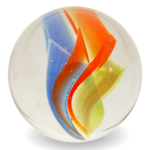

    

# Marble
Marble is a browser based on Mozilla Firefox (more specifically, the ESR variant) that aims to restore the Photon style & layout, while adding removed native styling features for various platforms.

## Credits

[Aubymori](https://github.com/aubymori) for the original Photon fixes for modern Firefox.
[Isabella Lulamoon](https://github.com/kawapure) for the original Native Controls Patch.
My house for food and electricity.

## Contributing

Because Marble is forked from Firefox, its documentation mostly applies for us as well.

Please read [this document](https://firefox-source-docs.mozilla.org/contributing/directory_structure.html) to understand the Mozilla directory structure.

Here are some useful sources for Mozilla documentation (in order):

1. [Mozilla Wiki (Gecko:Overview)](https://wiki.mozilla.org/Gecko:Overview) - by far the most useful source to understanding the Mozilla framework architecture.
2. [Firefox Source Docs](https://firefox-source-docs.mozilla.org/) - pertains more to modern Firefox specifically.
4. [Isabella's Documentation](https://kawapure.github.io/mozilla_simple_docs/) - written by researcher and aims to provide a good introduction to the Mozilla framework.

## Building from source

[Same as regular Firefox.](https://firefox-source-docs.mozilla.org/contributing/contribution_quickref.html)

